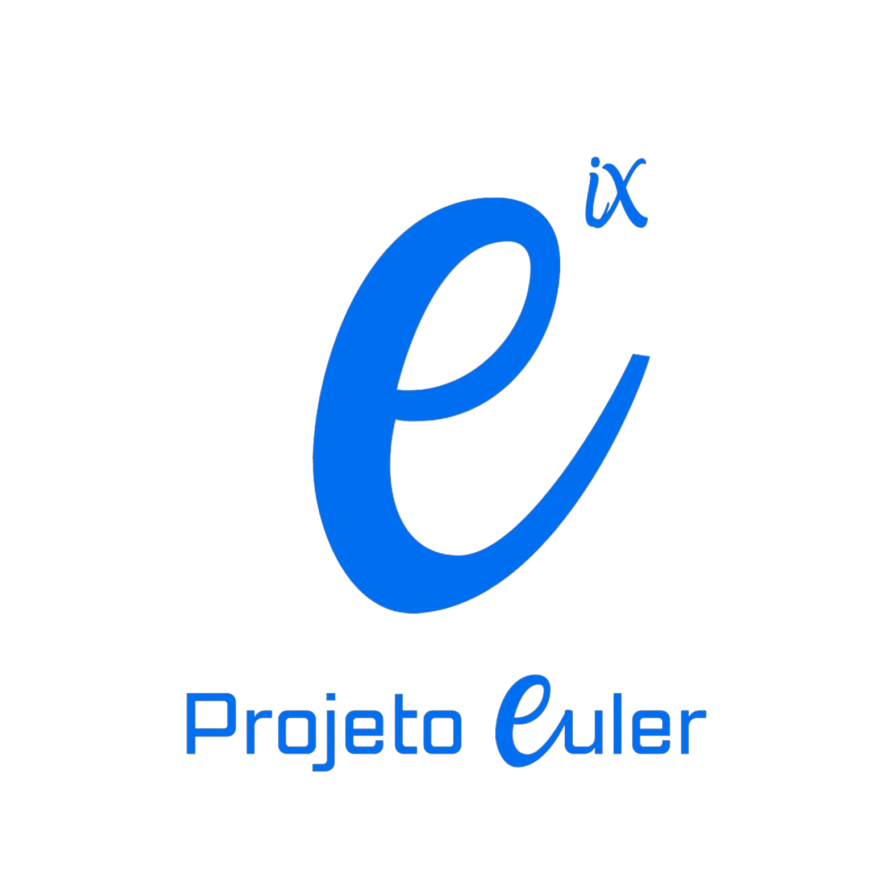

<h1 align="center">
   
  
</h1>

<h4 align="center">Projeto Euler - Ensinando cálculo com programação</h4>

    Um projeto iniciado na Universidade Federal Rural do Semi-Árido - UFERSA, campus Pau dos Ferros

  <a href="#resumo-do-projeto">Resumo</a> •
  <a href="#objetivo-do-projeto">Objetivo</a> •
  <a href="#linguagem-de-programação">Linguagem de Programação</a> •
  <a href="#membros">Membros</a> •
  <a href="#organização">Organização</a> •
  <a href="#suporte">Suporte</a>

## Resumo do Projeto

O Projeto Euler é uma iniciativa de extensão da UFERSA que visa incentivar os estudantes a aprimorarem suas habilidades em matemática e programação. Nossa equipe está trabalhando para resolver uma série de desafios computacionais do Projeto Euler. As soluções e metodologias serão então usadas como material de ensino para introduzir os alunos do ensino médio à programação.

## Objetivo do Projeto

O objetivo deste projeto é não apenas resolver os desafios do Projeto Euler, mas também usar essas soluções para desenvolver um currículo de programação para alunos do ensino médio. Queremos mostrar aos alunos como a matemática e a programação podem ser usadas para resolver problemas complexos. Acreditamos que ao fazer isso, podemos inspirar a próxima geração de programadores e matemáticos.

## Linguagem de Programação

  A linguagem de programação adotada para este projeto é a C. Isso significa que todos os códigos e soluções desenvolvidos como parte deste projeto serão escritos em C.

    

## Membros

  Estes são os nossos mebros que compõe a equipe do Projeto Euler!

<table>
  <tbody>
    

      <td align="center" valign="top" width="14.28%"><a href="https://github.com/Allan-Gabriell"> <b>Allan</b></a> <a href="https://github.com/Allan-Gabriell" title="Code">💻☕</a></td>
      <td align="center" valign="top" width="14.28%"><a href="https://github.com/LeticiaVieirg"> <b>Leticia</b></a> <a href="https://github.com/LeticiaVieirg" title="Code">💻💬</a></td>
      <td align="center" valign="top" width="14.28%"><a href="https://github.com/DanielNeres"> <b>Daniel</b></a> <a href="https://github.com/DanielNeres" title="Code">💻</a></td>
      <td align="center" valign="top" width="14.28%"><a href="https://github.com/KayqueLopes99"> <b>Kayque</b></a> <a href="https://github.com/KayqueLopes99" title="Code">💻📖</a></td>
      <td align="center" valign="top" width="14.28%"><a href="https://github.com/LeonardAugusto"> <b>Leonardo</b></a> <a href="https://github.com/LeonardAugusto" title="Code">💻🔧</a></td>
    

  </tbody>
</table>

## Organização

## Suporte

<h2 align="center">
  Precisando de suporte com o nosso material? Entre em contato conosco!
</h2>

    

